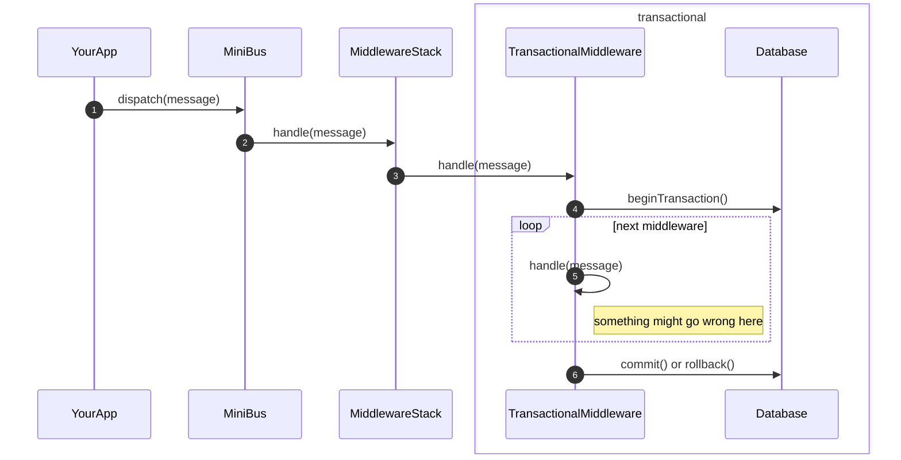
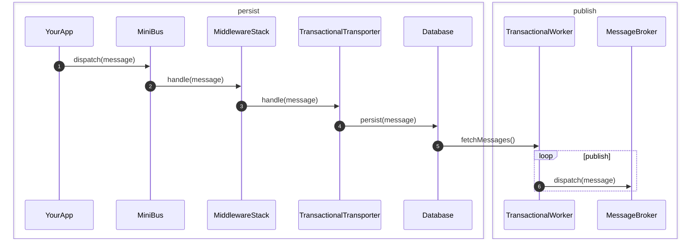

# Transactional MiniBus

## Transactional middleware

Make your MiniBus more safe by using a transactional middleware, so that either
all changes in a transaction are persisted, or all of them are rolled back.

e.g. imagine a scenario where `HandlerA` works OK, but `HandlerB` throws an
`Exception`. In such cases you probably want to rollback database changes
made by `HandlerA`. Then you could make both handlers run within
`TransactionalMiddleware`.

## Transactional transporter

Make your MiniBus compatible with the [transactional outbox pattern][1]:

> [...]  first store the message in the database as part of the transaction that
> updates the business entities. A separate process then sends the messages to the message broker.

A transactional transporter will persist the message into a database table,
using the same database connection as other services in your app.

Then a worker will fetch messages from the table and send them to the message
broker.

[1]: https://microservices.io/patterns/data/transactional-outbox.html
